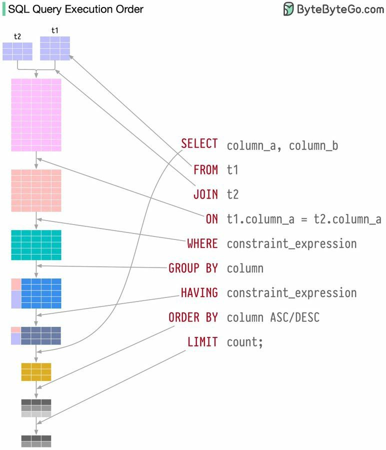
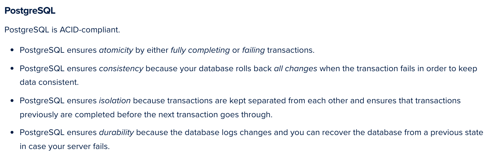

# SQL Execution Order
Visualizing SQL Queries\
[Source](https://www.linkedin.com/posts/imranimtiaz1_sql-databasemanagement-optimization-activity-7164657079788548097-01rF?utm_source=share&utm_medium=member_desktop)

A mental model can help visualize how SQL queries are executed. Conceptually, SQL statements can be thought of as executing in this sequence:

1. **FROM**: Tables are identified and joined to create the initial dataset.

2. **WHERE**: Filters are applied to the initial dataset based on specified criteria.

3. **GROUP BY**: The filtered rows are grouped according to the specified columns.

4. **HAVING**: Additional filters are applied to the grouped rows based on aggregate criteria.

5. **SELECT**: Specific columns are chosen from the resultant dataset for the output.

6. **ORDER BY**: The output rows are sorted by the specified columns in ascending or descending order.

7. **LIMIT**: The number of rows in the output is restricted.

**More Readings**
1. [How SQL Works Behind the Scenes](https://medium.com/@abil.samedov502/demystifying-the-database-engine-how-sql-works-behind-the-scenes-56859c27ef69)

# ACID Compliance in Postgres
