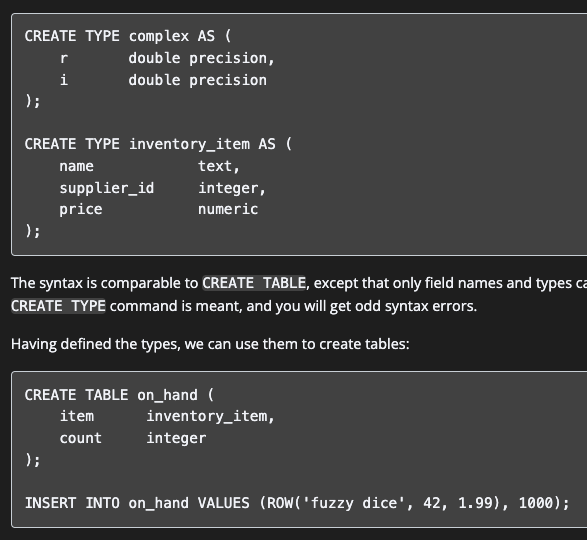

# COMP3311 - Week 3 Tut

## Admin
1. Quiz 2 due on Friday (14 June) at 11.59pm Sydney time
2. Week 2 Tut + Quiz 1 Answers should have been released
3. Please set up vxdb2 if you haven't

## Tut Questions
- Q2,3,4 → ER to Relational
- Recap of SQL
- Q5 → Relational to SQL
- Q7, 8 (can choose a few), 9 → SQL Theory
- Q10,12,13 → ER to SQL (Small)
- Q[14-20] → ER to SQL (Large)

## Recap on ER → Relational
- Entities → Tables
- Attributes → Columns in Tables
- Relationships → Separate Table(n:n) with primary keys being foreign keys
- Relationships → Put in One of the Tables (1:n/1:1)
  - For (1:n) we implement the relationship via a foreign key in the relation that has only one associated entity
  - For (1:1) we try to favour the side with total participation
- Subclass → ER | OO | Single-Table
- Foreign Key points towards Primary Key

## SQL Syntax
Creating Tables
```sql
create table Degrees (
  did char(4) check (did ~ '[0-9]{4}'),
  primary key(did),
  name text
);

create table Students (
  id serial primary key, -- serial gives unique integer values
  given text not null unique,
  family varchar(40),
  dob date not null,
  netWorth numeric (6, 2), 
  gender char(1) check (gender in ('M', 'F', 'X')),
  degree char(4) references Degrees(did)
);
```

Some Extra Notes
- In SQL, we use '' for strings. When we use "", it means we are making it into identifiers
  - Example, 'birthday' = 'BirthDay' = 'BIRTHdAY' != "BirthDay"
- User Defined Data Types -- Domain and Types
  - Domain = Constrained Versions of Existing Types
  - ```sql
    create domain age as integer check (value > 0);
    ```
  - Type = Enums/Composite Types -- different to existing types
  - ```sql
    create type grade as enum ('FL', 'PS', 'CR', 'DN', 'HD');
    ```
  - 
- Pattern Matching
  - Using `like` and `not like`
  - `%` matches anything
  - `_` matches any single character
  - ```sql
    name like 'Fo%' -- name begins with Fo
    name like 'B_r' -- 2nd letter is any character
    ```
  - for case insensitive matching, use `ilike` 
<br><br>
  - Using `~` and `!~`
  - ```
    name ~ '^DB' -- name begins with DB
    ```
  - for case insensitive matching, use `~*` and `!~*` 
